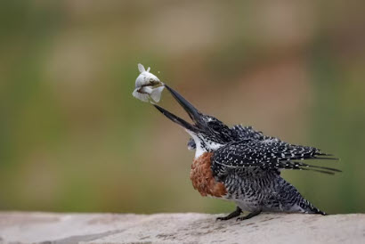

You can add images to your `.md` pages by using the [Markdown](https://daringfireball.net/projects/markdown/syntax#img) syntax for images.

## Examples

### Page resource

```md

```


#### Rendered HTML

```html

```

### Global resource

```md

```


### Remote resource

```md

```


